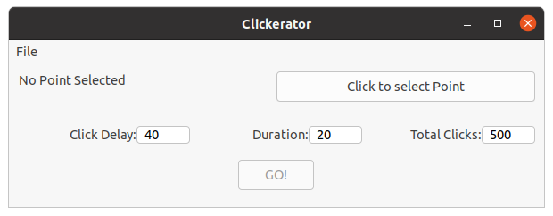

# Clickerator
A simple auto-clicker app using wxWidgets for use on Linux

Graphically select location of click. Choose delay between clicks, duration of clicking session and total number of clicks.

Ends up being a GUI wrapper around xdotool to do the actual clicking
